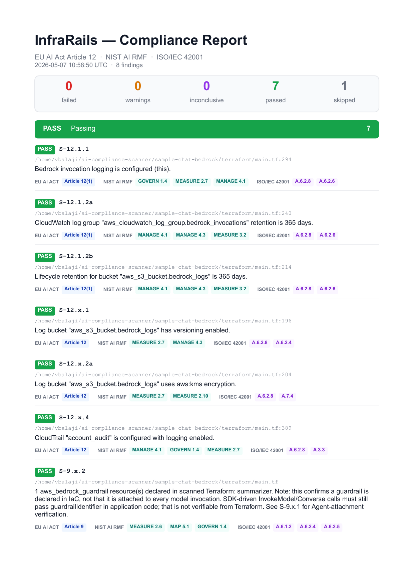
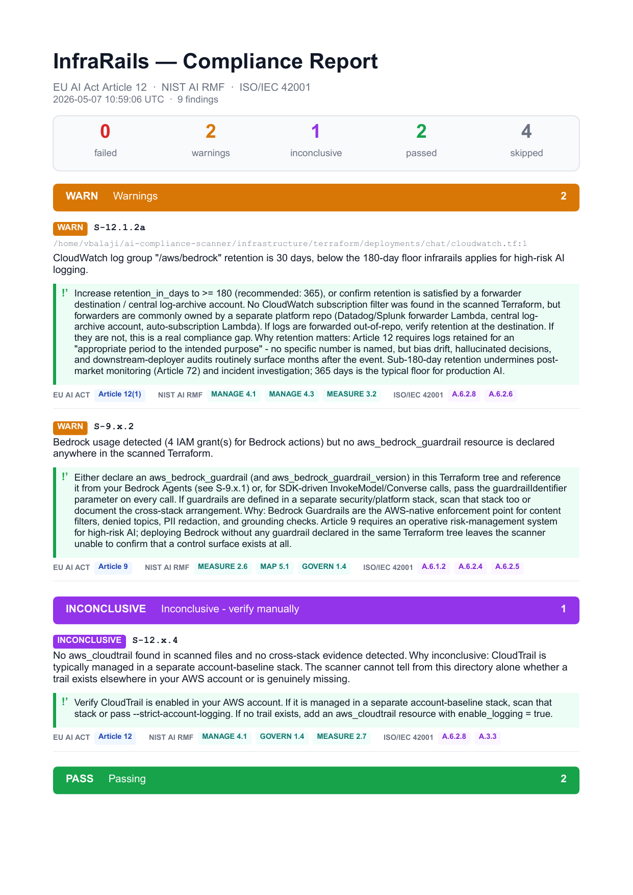

# infrarails

> Static compliance scanner for AWS AI infrastructure - checks your Terraform for the risk-management (Article 9 - Bedrock Guardrails) and logging, retention, and traceability (Article 12) gaps that surface at audit time, mapped to **EU AI Act**, **NIST AI RMF**, and **ISO/IEC 42001**.

[](LICENSE)
[](https://www.npmjs.com/package/infrarails)
[](https://nodejs.org/)

---

## What is this?

`infrarails` is built for teams running **high-risk AI systems on AWS Bedrock**, and for teams voluntarily adopting Article 9 / Article 12-equivalent controls under **NIST AI RMF** or **ISO/IEC 42001** even when the EU AI Act does not legally require them (procurement commitments, customer requirements, internal policy, or simply applying the same audit-grade controls to lower-risk workloads). It reads your **Terraform HCL source files** (and `.tf.json` files emitted by cdktf, Terragrunt, and other generators) and reports exactly which infrastructure-layer controls are passing, failing, or cannot be verified statically - giving you a clear, actionable readiness report without needing to deploy anything.

> **A note on EU AI Act risk tiers:** Articles 9 and 12 are mandatory only for **high-risk** systems under the Act. The Act has no "medium-risk" category - the tier between high-risk and minimal-risk is "limited risk", which carries only transparency obligations (Article 50). If you're applying these controls to a limited-risk system, you're going beyond what the Act requires - which is exactly what NIST AI RMF and ISO/IEC 42001 encourage as good practice.

Each finding is cross-referenced against three frameworks:

- **EU AI Act** (Regulation 2024/1689) - Article 9 (risk management for high-risk AI) and Article 12 (logging and traceability)
- **NIST AI RMF 1.0** - GOVERN / MEASURE / MANAGE / MAP functions
- **ISO/IEC 42001:2023** - Annex A controls (A.6.1.x objectives, A.6.2.x event logging / verification / deployment)

Concretely, the scanner inspects Terraform for the AWS primitives that back AI risk management and logging on Bedrock:

- `aws_bedrockagent_agent` (whether a guardrail is attached, with a numbered version rather than DRAFT)
- `aws_bedrock_guardrail` / `aws_bedrock_guardrail_version` (presence in the scanned tree when any Bedrock workload is detected)
- `aws_bedrock_model_invocation_logging_configuration` (whether invocation logging is configured and which modalities are enabled)
- The CloudWatch log group or S3 bucket that Bedrock writes to (retention, lifecycle, encryption, versioning); CloudWatch subscription filters as a forwarder signal
- `aws_cloudtrail` (an enabled trail covering control-plane events)
- Local vs remote Terraform modules (so cross-stack logging / risk-management topologies are flagged rather than silently passed)

The scanner is **deliberately conservative**: when it cannot prove a control is in place, it emits `INCONCLUSIVE` rather than `PASS` or `FAIL`. For a compliance tool, "we couldn't verify" is the only honest answer when the evidence is split across stacks, modules, or runtime values.

> ### Important: this is a prerequisite, not a certificate of compliance
>
> A fully passing `infrarails` run is a **necessary but not sufficient** condition for EU AI Act / NIST AI RMF / ISO 42001 conformance. `infrarails` only verifies that a narrow set of AWS Bedrock infrastructure primitives are **declared** in your Terraform. It does **not** evaluate organisational, procedural, application-level, or runtime controls. See the disclaimer at the bottom of every report for the full scope statement.

---

## Quick start

```bash
# 1. Install hcl2json (one-time, see Prerequisites for per-OS instructions)
brew install hcl2json            # macOS

# 2. Install infrarails
npm install -g infrarails

# 3. Scan a Terraform directory
infrarails ./infra/

# 4. Or generate a shareable PDF / HTML report
infrarails ./infra/ --format pdf  -o report.pdf
infrarails ./infra/ --format html -o report.html
```

> Runs natively on **macOS, Linux, and Windows** (PowerShell / `cmd.exe`). See [Prerequisites](#prerequisites) for per-OS install steps.

---

## Rules

`infrarails` ships **9 rules** mapped to Articles 9 and 12 of the EU AI Act, with cross-references to NIST AI RMF and ISO/IEC 42001. Each finding is one of: **PASS**, **FAIL**, **WARN**, **SKIP**, or **INCONCLUSIVE**.

| Rule ID | Severity | Phase | Article | Check |
|---|---|---|---|---|
| `S-9.x.1` | FAIL | 2 | 9 | Bedrock Agents must have a versioned guardrail attached (Agent-attached guardrails only - raw InvokeModel/Converse SDK calls are out of scope for static IaC scanning) |
| `S-9.x.2` | WARN | 2 | 9 | When Bedrock is in use, at least one `aws_bedrock_guardrail` should be declared in scanned Terraform (presence-level signal; complements `S-9.x.1`) |
| `S-12.1.1` | FAIL | 1 | 12 | AWS Bedrock model invocation logging is configured when Bedrock is in use |
| `S-12.1.2a` | WARN | 2 | 12 | CloudWatch log group used for Bedrock logs has a retention policy >= 180 days, or a forwarder pipe to an external log system was detected |
| `S-12.1.2b` | FAIL | 2 | 12 | S3 bucket used for Bedrock logs has a lifecycle policy of at least 180 days (FAIL below 180; WARN 180-364; PASS at >= 365) |
| `S-12.x.1` | FAIL | 2 | 12 | S3 log bucket has versioning (or object lock) enabled |
| `S-12.x.2a` | FAIL | 2 | 12 | S3 log bucket has KMS server-side encryption configured |
| `S-12.x.4` | FAIL | 2 | 12 | A CloudTrail trail is present and enabled |
| `S-12.x.5` | WARN | 2 | 12 | Flags remote modules whose contents the scanner cannot inspect |

Retention thresholds for `S-12.1.2a`: **PASS** at >= 365 days (or `retention_in_days = 0` for never-expire), **WARN** for everything else. The rule is intentionally WARN-only - in real enterprise estates, retention is often satisfied by a forwarder shipping logs to Datadog/Splunk/SIEM owned by a separate platform repo, by a central log-archive account (Control Tower / Landing Zone), or by an auto-subscription Lambda deployed out-of-band. A static single-repo scan cannot prove that retention is *missing*, so the rule warns rather than fails. When a `aws_cloudwatch_log_subscription_filter` targeting the log group is present in the scanned files, the WARN message says so explicitly; otherwise the message reminds the reader that forwarders are commonly out-of-repo and need to be verified at the destination.

Retention thresholds for `S-12.1.2b`: **PASS** at >= 365 days, **WARN** for 180-364 days, **FAIL** below 180 days. The graduated thresholds mirror `S-12.1.2a` on the CloudWatch side: 365 days is the audit-grade target, but a hard fail below 365 would over-flag estates that intentionally tier S3 log retention against a forwarder destination or a central log-archive account. 180 days is the floor below which post-market-monitoring (Article 72) and incident-investigation use cases routinely break.

---

## Architecture

`infrarails` is a small, layered TypeScript pipeline: a parser that turns `.tf` / `.tf.json` files into a uniform JSON representation (via [`hcl2json`](https://github.com/tmccombs/hcl2json)), a value **resolver** that classifies every expression as `literal`, `address`, or `unresolvable` (with a reason code), and a **two-phase rule engine** - Phase 1 builds a `ScanContext` of the buckets and log groups Bedrock is actually writing to, and Phase 2 rules consume that context to scope their checks. Local modules are walked transparently; remote modules are flagged but never fetched.

For the full pipeline diagram, the resolver outcome table, the `ScanContext` shape, and guidance for adding new rules, see **[ARCHITECTURE.md](ARCHITECTURE.md)**.

---

## Scenarios it can handle

The hardest part of static compliance scanning isn't matching resource types - it's distinguishing *"this is genuinely missing"* from *"this lives somewhere I can't see."* `infrarails` handles both, and it tells you which one you're looking at.

### Direct, in-file Bedrock + logging -> PASS

Bedrock resource and `aws_bedrock_model_invocation_logging_configuration` in the same scanned tree, with at least one modality enabled (or all modality toggles unset, which is AWS's enable-all default).

```hcl
resource "aws_bedrockagent_agent" "support_bot" { ... }

resource "aws_bedrock_model_invocation_logging_configuration" "main" {
  logging_config {
    s3_config { bucket_name = "prod-ai-audit-logs" }
  }
}
```
-> `S-12.1.1: PASS`

### All modality toggles explicitly false -> FAIL

A logging resource exists but every `*_data_delivery_enabled` is `false`. AWS will accept this configuration, but no events will actually be written.

```hcl
resource "aws_bedrock_model_invocation_logging_configuration" "main" {
  logging_config {
    text_data_delivery_enabled      = false
    image_data_delivery_enabled     = false
    embedding_data_delivery_enabled = false
    video_data_delivery_enabled     = false
    s3_config { bucket_name = "logs" }
  }
}
```
-> `S-12.1.1: FAIL - all data-delivery toggles set to false`

### Bedrock used, no logging in scanned files -> INCONCLUSIVE (default) or FAIL (strict)

By default, the scanner assumes account-baseline patterns are common (logging configured once at the org/account level, not per-stack) and emits `INCONCLUSIVE` so it doesn't generate false positives for teams with that topology. Pass `--strict-account-logging` to flip this to `FAIL` when you know the entire estate is in scope.

The decision is **only** driven by what is statically present in the scanned files - whether `aws_bedrock_model_invocation_logging_configuration` exists and (under strict mode) whether the user has asserted this directory is the entire estate. No naming-convention heuristics are applied: a `data.terraform_remote_state.<anything>` reference, a module called `bedrock_logging`, or an input key like `log_bucket` does **not** influence the verdict, because users can name those constructs anything they like and any naming-based suppression is a false positive waiting to happen. If logging really lives in another stack, scan that stack too - or accept the default `INCONCLUSIVE`.

### Short retention with a CloudWatch subscription filter -> WARN (forwarder-aware)

A common enterprise pattern: the app team's Terraform declares a Bedrock log group with `retention_in_days = 7` because the actual retention lives at a Datadog/Splunk/SIEM destination subscribed via `aws_cloudwatch_log_subscription_filter`. `S-12.1.2a` detects the subscription filter (matching by literal name, resource address, or resolved variable/local) and emits a WARN whose remediation explicitly notes the filter and reminds the reader to verify destination retention. When no filter is found in scanned files, the WARN remediation instead reminds the reader that forwarders are commonly owned by a separate platform repo or central log-archive account - the scanner cannot tell the difference between "no forwarder anywhere" and "forwarder in another repo." Either way, the rule is WARN-only and never FAILs on retention alone.

### Bedrock Guardrails - Agent-attached vs SDK runtime

Bedrock Guardrails attach to two surfaces: **(a)** Bedrock Agents via the `guardrail_configuration` block on `aws_bedrockagent_agent` - declared in HCL, statically verifiable; **(b)** raw `InvokeModel` / `Converse` SDK calls via the `guardrailIdentifier` parameter - passed in application code (Python/TypeScript/Java), invisible to a static IaC scanner.

`S-9.x.1` covers (a): for every `aws_bedrockagent_agent` it checks that a `guardrail_configuration` block is present, that `guardrail_identifier` is non-empty, and that `guardrail_version` is a numbered version rather than `"DRAFT"` (DRAFT versions are mutable and not auditable as a fixed control).

`S-9.x.2` covers a weaker but useful presence-level question: **"Bedrock is being used somewhere - is at least one `aws_bedrock_guardrail` declared anywhere in the scanned Terraform?"** It WARNs (never FAILs) when no guardrail is found, because guardrails are commonly defined in a separate security/platform stack and a single-repo scan can't see those. The remediation message names all three real possibilities: declare here, scan the security stack, or pass `guardrailIdentifier` in SDK code.

Neither rule attempts to verify (b) - that's an application-layer control surface (code review, SDK linting, runtime tracing) and is explicitly called out in both rules' descriptions and remediation messages so users don't read a passing `S-9.x.1` as covering their SDK-driven workloads.

### Indirect-only Bedrock signals -> always INCONCLUSIVE

IAM grants for `bedrock:*` actions, VPC endpoints to `bedrock-runtime`, or `aws_bedrock_foundation_model` data sources are *signals* that something nearby uses Bedrock - but the deploying resource may live in another stack entirely. These are never confident `FAIL`s, even under `--strict-account-logging`.

### Local modules -> scanned recursively

`module "bedrock_logging" { source = "./modules/bedrock_logging" }` is followed transparently - the module's `.tf` files are parsed alongside the root and contribute to the same context.

### Remote modules -> flagged, never scanned

Registry, git, http, and bitbucket sources can't be inspected statically. `S-12.x.5` emits an `INCONCLUSIVE` per remote module so they show up in the report instead of being silently ignored. If your only Bedrock-related logic is inside a remote module, `S-12.1.1` also emits an INCONCLUSIVE rather than a misleading SKIP.

### Variables, locals, and data sources -> resolved when possible

| Expression | Behavior |
|---|---|
| `"literal-bucket"` | Used directly |
| `var.bucket_name` with `default = "x"` | Resolved to `"x"` |
| `var.bucket_name` with no default | INCONCLUSIVE (`var-no-default`) |
| `local.bucket = "x"` | Resolved to `"x"` |
| `aws_s3_bucket.logs.id` | Resolved to that bucket's `bucket` attribute, if scanned |
| `data.aws_ssm_parameter.X.value` | INCONCLUSIVE (`data-source-ssm`) |
| `module.X.output_name` | INCONCLUSIVE (`module-output`) |
| `prefix-${var.X}` | INCONCLUSIVE (`complex-interpolation`) |

Variable resolution is **module-scoped** - a `var.foo` in `./modules/bedrock_logging/main.tf` only resolves against `variable` blocks in that same directory, not against unrelated `variable "foo"` declarations elsewhere in the tree.

### `.tf.json` support

cdktf, Terragrunt, and various code generators emit Terraform configuration as JSON. The parser handles `.tf.json` files alongside `.tf` - both produce the same internal representation.

---

## How to use

### Command

```bash
infrarails <directory> [options]
```

### Options

| Flag | Default | Description |
|---|---|---|
| `-f, --format <format>` | `terminal` | Output format: `terminal`, `json`, `html`, or `pdf`. Unknown values exit with code `2`. `pdf` is binary and **requires `-o`**; passing `--format pdf` without `-o` exits with code `2`. |
| `-o, --output <file>` | stdout | Write the rendered report to a file instead of stdout. Avoids the need to shell-redirect for `html`/`json` and prevents the common footgun of dumping markup into the terminal. When `-f html` or `-f json` is used without `-o` *and* stdout is a TTY, the CLI prints a one-line tip to stderr suggesting `-o`. The tip is silent when piped or redirected, so existing scripts and CI invocations are unaffected. Required for `--format pdf`. |
| `--no-strict` | strict on | Treat `INCONCLUSIVE` findings as non-blocking. By default INCONCLUSIVE blocks the exit code like FAIL - for a compliance tool, "we couldn't verify" should not pass a CI gate silently. |
| `--strict-account-logging` | off | When set, missing `aws_bedrock_model_invocation_logging_configuration` is treated as `FAIL` instead of `INCONCLUSIVE`. Use this only when the scanned tree is the entire infra estate (no separate account-baseline stack). The flag is the single knob: no naming-based hint downgrades the result. |
| `--version` | - | Print version |
| `-h, --help` | - | Print help |

### Examples

```bash
# Scan a Terraform module, human-readable output
infrarails ./infra/

# Generate an HTML report (with collapsible sections, framework pills, disclaimer)
infrarails ./infra/ --format html -o report.html

# Or with shell redirection (still works)
infrarails ./infra/ --format html > report.html

# Generate a PDF report (recommended for sharing - no SmartScreen warnings on Windows)
infrarails ./infra/ --format pdf -o report.pdf

# Output machine-readable JSON for CI/CD
infrarails ./infra/ --format json -o compliance-report.json

# Non-strict mode (INCONCLUSIVE will not block CI)
infrarails ./infra/ --no-strict

# Strict account-logging - fail when Bedrock is used but no logging config is in the tree
infrarails ./infra/ --strict-account-logging
```

### Exit codes

| Code | Meaning |
|---|---|
| `0` | No blocking findings |
| `1` | One or more blocking findings (FAIL, WARN; plus INCONCLUSIVE in strict mode) |
| `2` | Tool error - invalid directory, `hcl2json` not found, etc. |

---

## Prerequisites

`infrarails` needs two things on `PATH`:

| Dep | Why | Min version |
|---|---|---|
| **Node.js + npm** | Runtime for the CLI | Node 18+ (runtime) / Node 20.x, 22.x, or 24+ (development & tests) |
| **[`hcl2json`](https://github.com/tmccombs/hcl2json)** | Converts Terraform HCL → JSON internally | any recent release |

The CLI invokes `hcl2json` via `child_process.spawnSync` over stdin (no shell), so it works the same on macOS, Linux, and native Windows.

> **Why two Node versions?** The published CLI is built with `target: 'node18'` (see [tsup.config.ts](tsup.config.ts)), so end users only need Node 18+. Contributors running the test suite need Node **20.x, 22.x, or 24+** because vitest 4.x requires `^20.0.0 || ^22.0.0 || >=24.0.0`. Node 18 fails the test suite at startup with a `node:util` `styleText` import error; Node 21 and 23 (odd-numbered, non-LTS) are also excluded by vitest.

### macOS

```bash
# Node 20+ recommended (Node 18+ works for the published CLI, but contributors
# running the test suite need Node 20.x / 22.x / 24+ - see note above).
# Skip this step if you already have a suitable version via nvm/fnm/volta.
brew install node

# hcl2json
brew install hcl2json

# Verify
node --version && npm --version && hcl2json --version
```

### Linux (Ubuntu / Debian)

```bash
# Node 20+ via NodeSource (skip if you already have it).
# Node 18 works for running the published CLI but not for the test suite.
curl -fsSL https://deb.nodesource.com/setup_20.x | sudo -E bash -
sudo apt-get install -y nodejs

# hcl2json - prebuilt binary from the release page
curl -fsSL -o /tmp/hcl2json \
  https://github.com/tmccombs/hcl2json/releases/latest/download/hcl2json_linux_amd64
sudo install -m 0755 /tmp/hcl2json /usr/local/bin/hcl2json

# Verify
node --version && npm --version && hcl2json --version
```

For other distros (Fedora/Arch/etc.), install Node from your package manager and grab the matching `hcl2json_linux_*` binary from the [releases page](https://github.com/tmccombs/hcl2json/releases).

### Windows (PowerShell)

```powershell
# Node 20+ recommended - via winget, scoop, choco, or installer from https://nodejs.org.
# OpenJS.NodeJS.LTS currently resolves to a 20.x release.
winget install OpenJS.NodeJS.LTS

# Allow npm (a .ps1 script) to run. On a fresh Windows install the default
# execution policy is Restricted, which makes `npm --version` fail with
# "running scripts is disabled on this system". CurrentUser scope is enough
# and does not require admin.
Set-ExecutionPolicy -ExecutionPolicy RemoteSigned -Scope CurrentUser

# hcl2json - download the Windows binary and put it on PATH
$dest = "$env:USERPROFILE\bin"
New-Item -ItemType Directory -Force -Path $dest | Out-Null
Invoke-WebRequest `
  -Uri "https://github.com/tmccombs/hcl2json/releases/latest/download/hcl2json_windows_amd64.exe" `
  -OutFile "$dest\hcl2json.exe"
# Add %USERPROFILE%\bin to PATH for the current session (or add it permanently via System Properties)
$env:Path = "$dest;$env:Path"

# Verify (open a new PowerShell window first if you just changed the execution policy)
node --version; npm --version; hcl2json --version
```

> **If `Set-ExecutionPolicy` fails** with a Group Policy error (common on managed/corporate machines), use one of these workarounds instead: invoke npm via `cmd.exe` (`cmd /c npm --version`) or run a single command with a per-process bypass (`powershell -ExecutionPolicy Bypass -Command "npm install -g infrarails"`).

> **WSL alternative:** if you already work in WSL, follow the Linux instructions inside the WSL shell. Performance is best when the Terraform source tree lives in the WSL filesystem (`~/...`) rather than a Windows mount (`/mnt/c/...`).

---

## Installation

Pick whichever fits your workflow. Both produce a global `infrarails` command on `PATH`.

### From npm (recommended for end users)

```bash
npm install -g infrarails
```

To upgrade later:

```bash
npm update -g infrarails        # or: npm install -g infrarails@latest
```

To uninstall:

```bash
npm uninstall -g infrarails
```

### From GitHub (clone + build)

Use this if you want to track `main`, run from a feature branch, or modify the rules locally. Requires the prerequisites above (Node 20.x / 22.x / 24+ if you want to run tests; Node 18+ is enough if you only want to build and use the CLI), plus `hcl2json`.

```bash
# 1. Clone
git clone https://github.com/policyrails/infrarails.git
cd infrarails

# 2. Install dependencies and build the CLI
npm install
npm run build

# 3. Expose the local build as a global `infrarails` command
npm link
```

`npm link` creates a symlink in your global `node_modules` pointing at this checkout, so `git pull && npm run build` is enough to pick up upstream changes - no re-link needed. To unlink:

```bash
npm unlink -g infrarails
```

> **Windows (PowerShell):** the same three commands work as written. `npm link` may need an elevated shell the first time, depending on how Node was installed.

---

## Output formats

### Terminal (default)

Colour-coded, grouped by status, with framework cross-references on each finding:

```
InfraRails — Compliance Report
EU AI Act Article 12  ·  NIST AI RMF  ·  ISO/IEC 42001

1 passed   0 failed   1 warnings   1 inconclusive   3 skipped

- WARN (1) -

⚠ S-12.1.2a  CloudWatch log group "/aws/bedrock/model-invocation-logs" has no retention_in_days declared.
   ./infra/bedrock/main.tf:23
   → Set retention_in_days explicitly: a value >= 180 (recommended: 365). No CloudWatch subscription filter was found in the scanned Terraform, but forwarders are commonly owned by a separate platform repo (Datadog/Splunk forwarder Lambda, central log-archive account, auto-subscription Lambda)...
   EU Article 12(1)  ·  NIST MANAGE 4.1, MANAGE 4.3, MEASURE 3.2  ·  ISO A.6.2.8, A.6.2.6

- INCONCLUSIVE (1) -

? S-12.x.4  No aws_cloudtrail found in scanned files...
   → Verify CloudTrail is enabled in your AWS account...
   EU Article 12  ·  NIST MANAGE 4.1, GOVERN 1.4, MEASURE 2.7  ·  ISO A.6.2.8, A.3.3

Disclaimer: This report reflects the findings of an automated static analysis...
```

### HTML

Self-contained, single-file HTML report with:

- Summary bar with counts per status
- Collapsible sections per status (FAIL/WARN/INCONCLUSIVE expanded by default; PASS/SKIP collapsed)
- Coloured framework pills (EU / NIST / ISO) with hover tooltips showing the full control description
- Print-friendly CSS (collapsed sections hidden, no shadows)
- Full disclaimer block at the bottom

```bash
infrarails ./infra/ --format html -o report.html
open report.html
```

### PDF

Single-file, paginated PDF rendered server-side via [`pdfkit`](https://pdfkit.org/) - no headless Chromium, no system dependencies. Layout mirrors the HTML report (summary bar, status sections, framework pills, full disclaimer). Recommended for sharing with auditors and over channels where HTML is awkward.

PDF is binary, so `-o` is required; running `--format pdf` without `-o` exits with code `2` rather than dumping bytes into the terminal.

On Windows, PDF is the preferred share format because Windows SmartScreen flags HTML opened from UNC paths (`\\wsl.localhost\...`, network shares); PDFs open without that warning.

```bash
infrarails ./infra/ --format pdf -o report.pdf
```

#### Sample reports

Page 1 of two real scans, generated with the command above:

| `sample-chat-bedrock` (small, focused stack) | `infrastructure` (large multi-stack estate) |
| --- | --- |
| [](docs/samples/sample-report-bedrock.png) | [](docs/samples/sample-report-infrastructure.png) |

### JSON

```json
{
  "summary": {
    "total": 6,
    "pass": 1,
    "fail": 0,
    "warn": 1,
    "skip": 3,
    "inconclusive": 1
  },
  "findings": [
    {
      "ruleId": "S-12.1.2a",
      "status": "WARN",
      "description": "CloudWatch log group ... has no retention_in_days declared.",
      "remediation": "Set retention_in_days explicitly... No CloudWatch subscription filter was found in the scanned Terraform...",
      "regulatoryReference": "EU AI Act Article 12(1) - Logs retained for appropriate period",
      "nistReference": "NIST AI RMF: MANAGE 4.1 (post-deployment monitoring); MANAGE 4.3 (incident communication); MEASURE 3.2 (risk tracking)",
      "isoReference": "ISO/IEC 42001:2023 Annex A: A.6.2.8 (AI system event logs); A.6.2.6 (operation and monitoring)"
    }
  ]
}
```

---

## CI integration

### GitHub Actions

```yaml
- name: Compliance scan
  run: |
    npm install -g infrarails
    infrarails ./infra/ --format json -o compliance-report.json
  continue-on-error: false

- name: Upload HTML report
  run: infrarails ./infra/ --format html -o report.html

- name: Upload artifacts
  uses: actions/upload-artifact@v4
  with:
    name: compliance-report
    path: |
      compliance-report.json
      report.html
```

### GitLab CI

```yaml
compliance:
  stage: validate
  script:
    - npm install -g infrarails
    - infrarails ./infra/ --format json -o compliance-report.json
    - infrarails ./infra/ --format html -o report.html
  artifacts:
    paths:
      - compliance-report.json
      - report.html
```

### Recommendation for CI gates

In a CI pipeline you have two reasonable choices:

- **Strict mode (default)** - `INCONCLUSIVE` blocks the build. Forces engineers to prove logging is in place (or wave the finding through explicitly). Best for high-assurance environments.
- **`--no-strict`** - only `FAIL`/`WARN` block. Best when you have a known cross-stack logging topology that the scanner cannot reach from a single repo.

Once Sprint 1B (`--plan` mode) lands, scanning Terraform plan JSON eliminates most INCONCLUSIVEs because plan output contains fully-resolved values.

---

## Roadmap

| Sprint | Status | Scope |
|---|---|---|
| **1A** | Done | Terraform HCL/JSON source scanning - 7 rules, value resolver, two-phase engine, cross-stack/local-module detection, NIST + ISO cross-references, terminal/JSON/HTML outputs |
| **1B** | In progress | `--plan` mode: scan `terraform show -json` plan/state output - eliminates `INCONCLUSIVE` for CI gates |
| **1C** | Planned | CDK and CloudFormation support; Bedrock Agent guardrail rules

### Sprint 1B preview - plan/state mode

Once 1B lands, `infrarails` will accept Terraform plan JSON as input. Because plan output contains fully-resolved values (no variables, no unbuilt module outputs), this eliminates most `INCONCLUSIVE` findings and is the recommended path for CI compliance gates.

```bash
# Pre-deployment gate (recommended CI workflow)
terraform plan -out=plan.tfplan
terraform show -json plan.tfplan > plan.json
infrarails --plan plan.json --format json

# Post-deployment audit
terraform show -json > state.json
infrarails --plan state.json --mode post --format json
```

---

## Contributing

Contributions are welcome. Please open an issue before submitting a pull request for significant changes.

1. Fork the repository
2. Create a feature branch: `git checkout -b feature/my-change`
3. Install dependencies: `npm install`
4. Run tests: `npm test`
5. Build: `npm run build`
6. Submit a pull request

### Adding a new rule

See the **[Adding a new rule](ARCHITECTURE.md#adding-a-new-rule)** section in [ARCHITECTURE.md](ARCHITECTURE.md), which covers the `ScanRule` interface, the two-phase model, naming conventions, and the test-fixture layout.

---

## License

Copyright 2026 - Licensed under the [Apache License, Version 2.0](LICENSE).

You may use, distribute, and modify this software under the terms of the Apache 2.0 license. See the [LICENSE](LICENSE) file for the full license text.

---

## Disclaimer

This report reflects the findings of an automated static analysis of your AWS AI infrastructure configuration against selected controls from the **EU AI Act**, **NIST AI RMF**, and **ISO/IEC 42001**. A passing result indicates that the scanned Terraform configuration satisfies the specific infrastructure-layer prerequisite checked - it does not constitute compliance with any of these frameworks, nor does it substitute for a formal audit, certification, or conformity assessment conducted by an accredited body.

Compliance with the EU AI Act, NIST AI RMF, and ISO/IEC 42001 requires organisational, procedural, and governance measures that are outside the scope of infrastructure scanning. This report should be treated as a **pre-audit readiness input**, not an attestation of conformance.
